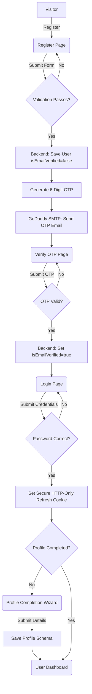
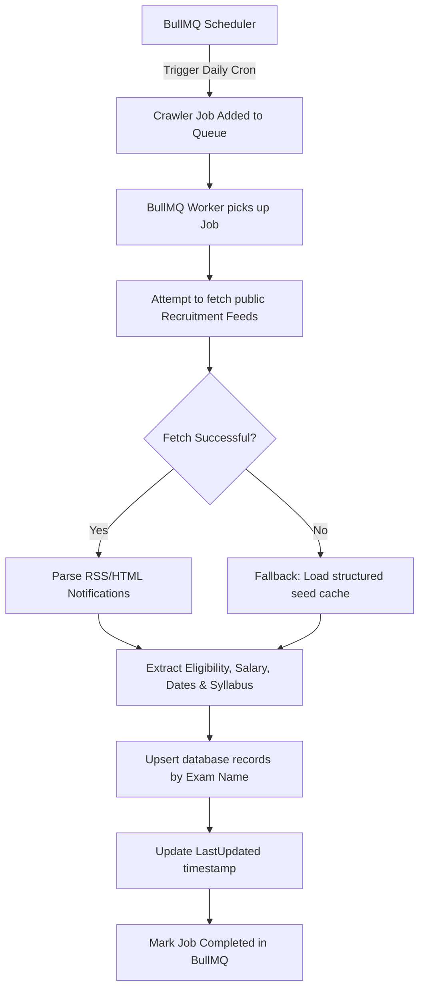
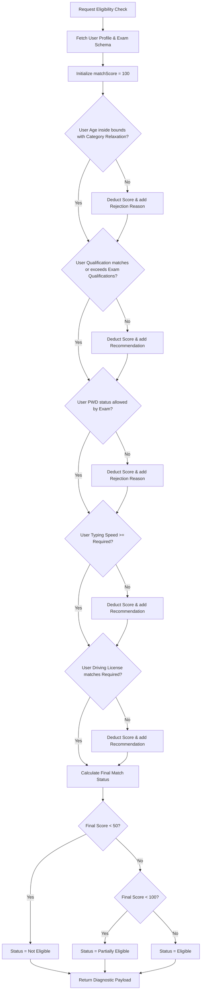

# SK CareerHub AI

India's AI-Powered Government Career & Recruitment Platform.

---

## Overview

**SK CareerHub AI** is an enterprise-grade recruitment and career ecosystem designed specifically for Indian government job aspirants. Unlike traditional job portals that require manual tracking across dozens of state and central recruitment sites, this platform automates the entire lifecycle—automatically crawling active exam details, parsing notification syllabi, matching qualifications with category relaxations, and rendering matching diagnostics to candidates.

---

## Table of Contents

- [Overview](#overview)
- [Key Features](#key-features)
- [System Architecture & Core Sections](#system-architecture--core-sections)
  - [Shared Packages](#shared-packages)
  - [Backend API Service](#backend-api-service)
  - [Frontend Client Application](#frontend-client-application)
  - [Distributed Background Queues](#distributed-background-queues)
- [Operational Workflows & Flowcharts](#operational-workflows--flowcharts)
  - [User Onboarding & OTP Flow](#user-onboarding--otp-flow)
  - [Background Crawler & Seeding Pipeline](#background-crawler--seeding-pipeline)
  - [Eligibility Evaluation Matrix](#eligibility-evaluation-matrix)
- [Getting Started & Local Development](#getting-started--local-development)

---

## Key Features

*   **Automated Government Notification Crawler**: Continually monitors public recruitment feeds, parses details, summaries notification requirements, and updates database records automatically.
*   **AI Eligibility Matching Engine**: Matches applicant profile details (age, caste category, degrees, sports quotas, typing speed, and driving licenses) against active exams. Handles age relaxations for reserved categories (OBC, SC, ST, EWS) and qualification hierarchies.
*   **Onboarding Wizard**: Step-by-step profile builder capturing criteria to calculate eligibility matches.
*   **Glassmorphic Analytics Dashboard**: Premium SaaS interface displaying matched vacancies, compatibility scores, timelines, and preparation checklists.
*   **Detailed Diagnostic Overlay**: Breaks down match requirements, indicating exactly why an applicant qualifies or fails, along with preparation recommendations.
*   **Secure Session Token Rotation**: Manages session state via Access Tokens and HTTP-Only Secure Cookies for Refresh Tokens to prevent cookie stealing or XSS attacks.
*   **Godaddy SMTP Transactional Alerting**: Delivers secure, transactional email dispatches for OTP confirmations and password resets.

---

## System Architecture & Core Sections

### Shared Packages
Designed as a monorepo workspace to guarantee modularity and type consistency. Shared packages contain:
*   **Types**: Global TypeScript interfaces shared between frontend and backend to guarantee strict compilation safety for user accounts, profiles, audits, and exams.
*   **Configuration**: Centralized configuration parameters including custom tailwind animations, shadows, color palettes, and theme tokens.
*   **UI Component Library**: Highly reusable, styled glassmorphic widgets, loading buttons, and responsive inputs utilizing Framer Motion.

### Backend API Service
Built in strict TypeScript using Express.js and structured via Controller-Service-Repository design patterns to separate database querying, validation, routing, and business logic:
*   **Routing & Controller Layer**: Coordinates HTTP requests, runs Zod schema schema validations, and extracts route inputs.
*   **Service Layer**: Handles auth logic, hashes passwords, generates secure tokens, and evaluates eligibility matches.
*   **Repository Layer**: Abstracts database operations and runs queries on Mongoose and Redis.
*   **Security & Exception Guard**: Implements Helmet headers, CORS policies, client rate-limit windows, cookie parsers, and a global error handling middleware translating exceptions to standard HTTP error states.

### Frontend Client Application
A fast, single-page application built on Vite, React 19, Zustand state stores, and TanStack Query fetching caches:
*   **Theme Engine**: Floating controllers with support for Light and premium Dark modes.
*   **Route Guards**: Dynamic client-side layout guards separating public views from onboarding profiles and dashboard access.
*   **API Interceptor**: Axios clients that automatically intercept expired access tokens and query refresh session cookies seamlessly.

### Distributed Background Queues
Background execution handles crawler aggregates without lagging HTTP requests:
*   **BullMQ queues**: Distributed queue architecture connecting through Redis, mapping retry limits and exponential backoff parameters.
*   **Scheduled Cron Jobs**: Schedules daily aggregators, spinning up background workers that update notifications automatically.

---

## Operational Workflows & Flowcharts

### User Onboarding & OTP Flow
This diagram details the flow when a new user signs up, verifies their account via OTP, completes their profile, and signs in.



---

### Background Crawler & Seeding Pipeline
This flowchart illustrates the automatic aggregation queue that checks public feeds, downloads updates, and populates the database.



---

### Eligibility Evaluation Matrix
This flowchart shows how the system evaluates a user's match score against a specific exam's criteria.



---

## Getting Started & Local Development

To run the project locally, install dependencies using your package manager, start the Docker Compose database services (or ensure local MongoDB and Redis instances are running natively), and trigger the startup script:

1.  **Start Services**: Automatically opens your Docker Desktop daemon, waits for the engines to boot, pulls MongoDB and Redis images, and spins up the environment:
    ```bash
    npm start
    ```
2.  **Verify Setup**: Open your browser and navigate to the frontend local server address. Register a new user, check your console log stream to copy the test OTP preview link, verify, and complete your match onboarding profile.
